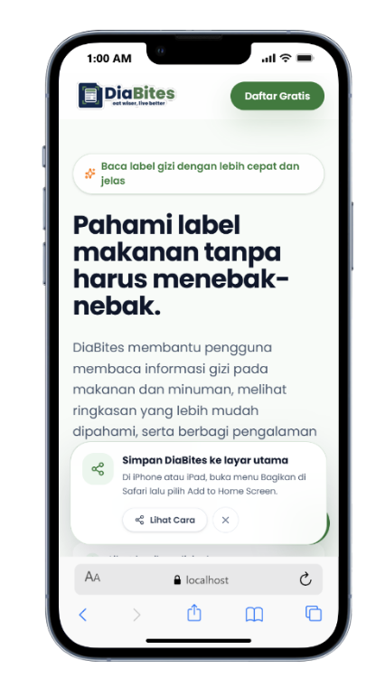
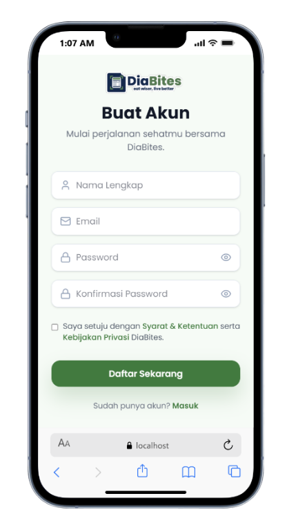
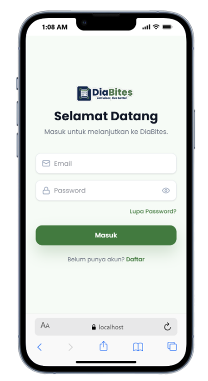
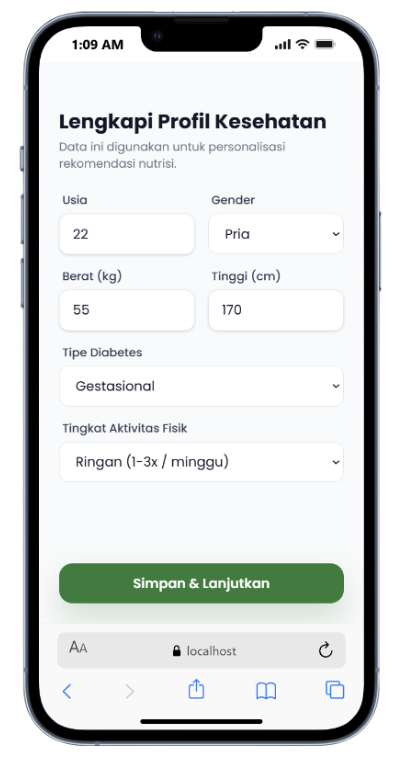
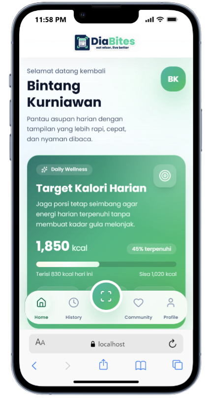
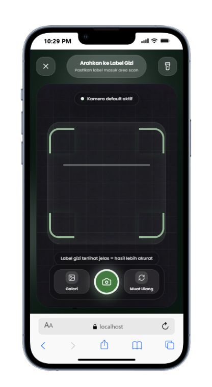
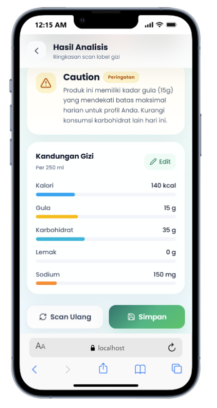
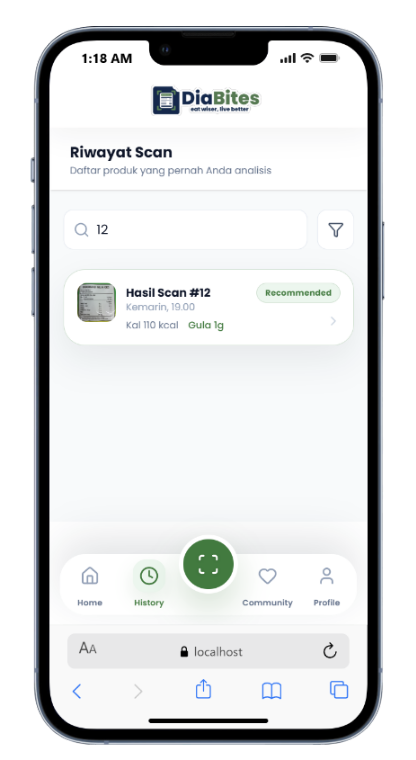
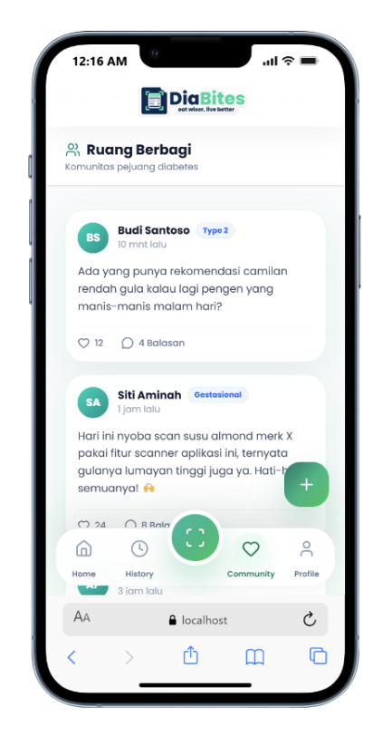

# DiaBites Frontend

Frontend resmi untuk **DiaBites**, sebuah aplikasi web dan PWA yang membantu pengguna memahami label gizi produk makanan dan minuman dengan lebih cepat, lebih jelas, dan lebih relevan untuk kebutuhan penderita diabetes.

Project ini dibangun dengan **React + Vite** dan dirancang untuk pengalaman mobile-first, ringan, modern, dan nyaman dipakai sehari-hari, mulai dari proses onboarding, scan label gizi, membaca hasil analisis, menyimpan riwayat, sampai berdiskusi di komunitas.

---

## Tentang Aplikasi

DiaBites adalah aplikasi yang berfokus pada:

- membantu pengguna membaca label gizi tanpa harus menafsirkan tabel kecil secara manual,
- memberi ringkasan nutrisi yang lebih mudah dipahami,
- menyesuaikan rekomendasi dengan profil kesehatan pengguna,
- menyimpan hasil scan untuk pemantauan harian,
- dan menyediakan ruang komunitas untuk berbagi pengalaman.

Frontend ini menghubungkan pengguna dengan backend RESTful API DiaBites dan layanan AI untuk analisis label gizi.

---

## Fitur Utama

### 1. Landing Page Produk

- Menjelaskan value proposition DiaBites
- Menampilkan preview fitur utama aplikasi
- Menyediakan akses cepat ke login dan registrasi
- Menyediakan chatbot edukatif di landing page

<p align="center">
  
</p>

### 2. Autentikasi Pengguna

a. **Registrasi Akun Baru**

Fitur registrasi digunakan oleh pengguna baru untuk membuat akun sebelum dapat mengakses fitur utama aplikasi DiaBites. Pada halaman registrasi, pengguna diminta untuk mengisi beberapa data akun yang dibutuhkan oleh sistem.

- Pengguna dapat membuat akun baru melalui halaman registrasi.
- Pengguna mengisi data berupa nama, email, dan password.
- Sistem melakukan validasi terhadap data yang dimasukkan pengguna.
- Email yang digunakan harus belum terdaftar pada sistem.
- Password digunakan sebagai kredensial untuk proses login berikutnya.
- Setelah registrasi berhasil, data akun pengguna akan disimpan ke database.
- Akun yang berhasil dibuat dapat digunakan untuk masuk ke aplikasi DiaBites.
<p align="center">
  
</p>

b. **Login Pengguna**

Fitur login digunakan oleh pengguna yang sudah memiliki akun untuk masuk ke dalam aplikasi. Proses login dilakukan dengan mencocokkan email dan password yang dimasukkan pengguna dengan data akun yang tersimpan pada sistem.

- Pengguna dapat masuk ke aplikasi menggunakan email dan password.
- Sistem memeriksa kesesuaian email dan password pengguna.
- Jika data login benar, sistem akan memberikan akses ke aplikasi.
- Sistem membuat session pengguna menggunakan access token dan refresh token.
- Access token digunakan untuk mengakses fitur yang membutuhkan autentikasi.
- Refresh token digunakan untuk memperbarui session ketika access token sudah tidak berlaku.
- Aplikasi dapat melakukan auto bootstrap session saat dibuka kembali.
- Jika session masih valid, pengguna tidak perlu melakukan login ulang.
- Jika login gagal, sistem akan menampilkan pesan kesalahan kepada pengguna.

<p align="center">
  
</p>

### 3. Setup Profil Kesehatan

Pengguna melengkapi data:

- usia
- gender
- berat badan
- tinggi badan
- tipe diabetes
- tingkat aktivitas fisik

Data ini dipakai untuk personalisasi perhitungan target dan rekomendasi nutrisi.

<p align="center">
  
</p>

### 4. Dashboard / Home

- Menampilkan sapaan personal
- Menampilkan target kalori harian
- Menampilkan ringkasan total gula dan karbohidrat hari ini
- Menampilkan profil kesehatan singkat
- Menyediakan CTA cepat ke scanner

<p align="center">
  
</p>

### 5. Scanner Label Gizi

- Kamera live preview
- Capture label gizi langsung dari aplikasi
- Upload dari galeri
- UI scan yang fokus ke area label

<p align="center">
  
</p>

### 6. Hasil Analisis Nutrisi

- Menampilkan hasil pembacaan label gizi
- Menampilkan nutrisi utama seperti kalori, gula, karbohidrat, lemak, dan sodium
- Menampilkan status rekomendasi konsumsi
- Mendukung koreksi manual jika OCR/AI kurang akurat
- Gambar hasil scan bisa dibuka dalam preview responsif

<p align="center">
  
</p>

### 7. Riwayat Scan

- Menyimpan hasil scan yang sudah disimpan pengguna
- Mendukung pencarian produk
- Mendukung buka detail riwayat
- Mendukung preview gambar hasil scan
- Terintegrasi dengan refresh data SPA setelah scan baru disimpan

<p align="center">
  
</p>

### 8. Komunitas

- Menampilkan feed postingan komunitas
- Membuat postingan baru
- Melihat detail thread
- Menambahkan komentar dan balasan
- Like post dan like komentar

<p align="center">
  
</p>

### 9. Profil Pengguna

- Edit profil pribadi
- Upload/ganti foto profil
- Edit data kesehatan
- Ganti password
- Logout

### 10. Chatbot Edukatif

- Hadir khusus di landing page
- Konsep floating chat buka-tutup
- Terhubung ke endpoint chatbot melalui `.env`
- Cocok untuk pertanyaan ringan seputar diabetes dan label gizi

### 11. Progressive Web App

- Bisa di-install ke home screen
- Memiliki manifest PWA
- Menggunakan service worker production
- Memiliki shortcut untuk Scanner, Riwayat, dan Komunitas

---

## Alur Penggunaan Aplikasi

### Alur singkat pengguna baru

1. Pengguna membuka landing page DiaBites.
2. Pengguna membuat akun atau login.
3. Pengguna melengkapi profil kesehatan.
4. Pengguna masuk ke halaman home untuk melihat ringkasan harian.
5. Pengguna membuka scanner dan mengambil gambar label gizi.
6. Sistem menampilkan hasil analisis nutrisi.
7. Jika perlu, pengguna bisa mengoreksi data gizi manual.
8. Pengguna menyimpan hasil scan.
9. Data langsung masuk ke riwayat dan dashboard diperbarui otomatis.
10. Pengguna dapat melihat riwayat atau berdiskusi di komunitas.

### Alur scan label gizi

1. Buka halaman `Scanner`.
2. Arahkan kamera ke label nutrisi atau pilih gambar dari galeri.
3. Sistem mengirim gambar ke backend dan AI service.
4. Hasil nutrisi ditampilkan di halaman `Scan Result`.
5. Jika OCR kurang akurat, pengguna bisa edit manual.
6. Setelah disimpan, pengguna diarahkan kembali ke scanner dan data home ikut tersinkron.

---

## Stack yang Digunakan

| Kategori | Teknologi |
| --- | --- |
| Framework UI | React 19 |
| Bundler / Dev Server | Vite 8 |
| Styling | Tailwind CSS 4 |
| Routing | React Router DOM 7 |
| HTTP Client | Axios |
| Icon System | Lucide React |
| Notification | React Hot Toast |
| PWA | vite-plugin-pwa, Workbox |
| State / Session | React Context + localStorage/sessionStorage |

---

## Arsitektur Frontend Singkat

### Routing utama

| Route | Fungsi |
| --- | --- |
| `/` | Landing page |
| `/login` | Login |
| `/register` | Registrasi |
| `/setup-profile` | Lengkapi profil kesehatan |
| `/home` | Dashboard |
| `/scanner` | Scanner label gizi |
| `/scan-result` | Hasil analisis |
| `/history` | Riwayat scan |
| `/history/:id` | Detail riwayat |
| `/community` | Feed komunitas |
| `/community/:id` | Detail thread komunitas |
| `/profile` | Profil pengguna |

### Struktur fitur utama

```text
src/
|- components/
|  |- common/
|  |- layout/
|- context/
|- layouts/
|- pages/
|- services/
|- utils/
```

### Pola data

- `src/services/api.js`
  Mengelola seluruh koneksi HTTP ke backend dan token refresh flow.

- `src/context/UserContext.jsx`
  Menyimpan session, profile, dashboard, dan helper auth global.

- `src/pages/*`
  Menyusun flow aplikasi dari landing, auth, scanner, history, community, sampai profile.

---

## Integrasi API

Frontend ini terhubung ke backend DiaBites melalui Axios.

Fitur integrasi yang sudah ada:

- login / register / logout
- refresh token otomatis saat access token expired
- pengambilan profil user
- dashboard harian
- upload scan image
- simpan hasil scan
- ambil riwayat scan
- komunitas, komentar, dan like

Chatbot landing page memakai endpoint terpisah yang dikonfigurasi via environment variable.

---

## Environment Variables

Buat file `.env` di root frontend.

Contoh:

```env
VITE_API_BASE_URL=http://localhost:3000/api
VITE_CHATBOT_API_URL=https://huggingface.co/spaces/fzikri169/diabites-chatbot-indonesia
```

Keterangan:

| Variable | Fungsi |
| --- | --- |
| `VITE_API_BASE_URL` | Base URL backend REST API DiaBites |
| `VITE_CHATBOT_API_URL` | URL chatbot. Jika berupa URL Hugging Face Space, frontend akan mengarahkannya otomatis ke endpoint `/chat` |

---

## Menjalankan Project

### 1. Install dependency

```bash
npm install
```

### 2. Jalankan development server

```bash
npm run dev
```

### 3. Build production

```bash
npm run build
```

### 4. Preview hasil build

```bash
npm run preview
```

---

## Scripts

| Script | Fungsi |
| --- | --- |
| `npm run dev` | Menjalankan Vite development server |
| `npm run build` | Build production |
| `npm run preview` | Preview hasil build |
| `npm run lint` | Menjalankan ESLint |
| `npm run generate:pwa-assets` | Generate aset ikon PWA |

---

## Pengalaman Pengguna yang Didukung

- Mobile-first layout dengan shell aplikasi vertikal
- Bottom navigation untuk area utama aplikasi
- Protected route untuk halaman setelah login
- Session restore saat aplikasi dibuka kembali
- Preview gambar responsif pada riwayat dan hasil scan
- Cache PWA production
- Prompt install untuk iOS / standalone mode
- Chatbot edukatif yang tidak mengganggu layar landing page

---

## Desain dan UI Notes

Beberapa prinsip UI yang dipakai di frontend ini:

- palet warna hijau yang mengikuti identitas logo DiaBites
- layout yang terasa ringan dan lega
- penggunaan kartu, radius besar, dan bayangan lembut
- fokus pada keterbacaan data nutrisi
- flow yang jelas untuk aksi utama seperti scan, simpan, dan lihat riwayat

---

## Dependensi Utama

Berikut dependensi inti yang dipakai di project ini:

- `react`
- `react-dom`
- `react-router-dom`
- `axios`
- `tailwindcss`
- `@tailwindcss/vite`
- `lucide-react`
- `react-hot-toast`
- `vite-plugin-pwa`
- `workbox-window`

---

## Catatan Penting

- Frontend ini mengandalkan backend DiaBites agar fitur utama berjalan penuh.
- Analisis nutrisi dan penyimpanan data tidak berjalan tanpa backend/API.
- Chatbot di landing page juga membutuhkan endpoint aktif agar bisa menjawab pertanyaan.
- Service worker development sengaja dimatikan agar tidak mengganggu iterasi lokal.

---

## Ringkasnya

**DiaBites Frontend** adalah antarmuka pengguna untuk aplikasi pemindai label gizi yang:

- modern,
- responsif,
- dapat di-install sebagai PWA,
- terhubung dengan backend REST API,
- dan dirancang untuk membantu pengguna membuat keputusan konsumsi yang lebih bijak.
